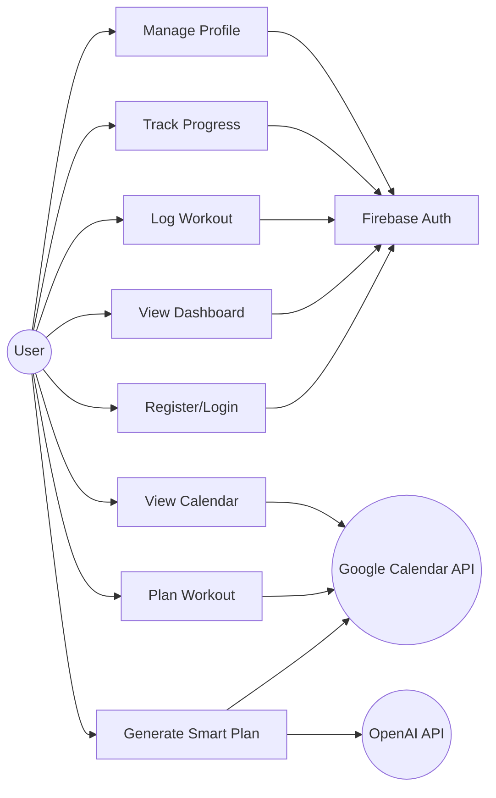
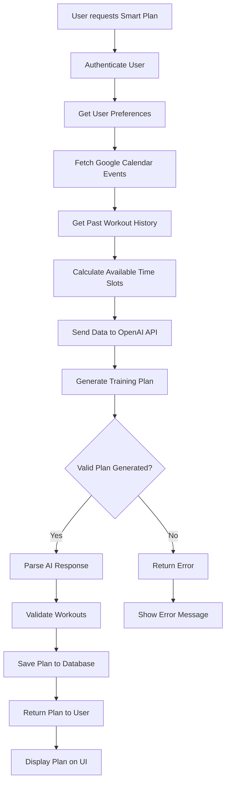
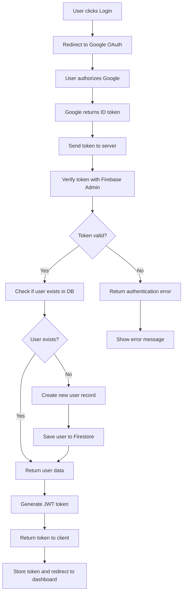
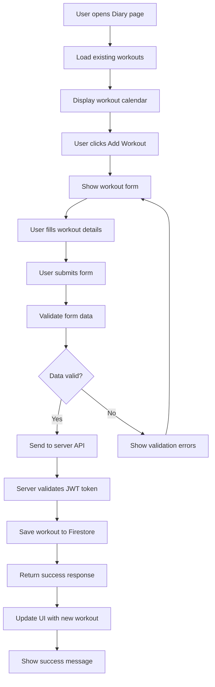
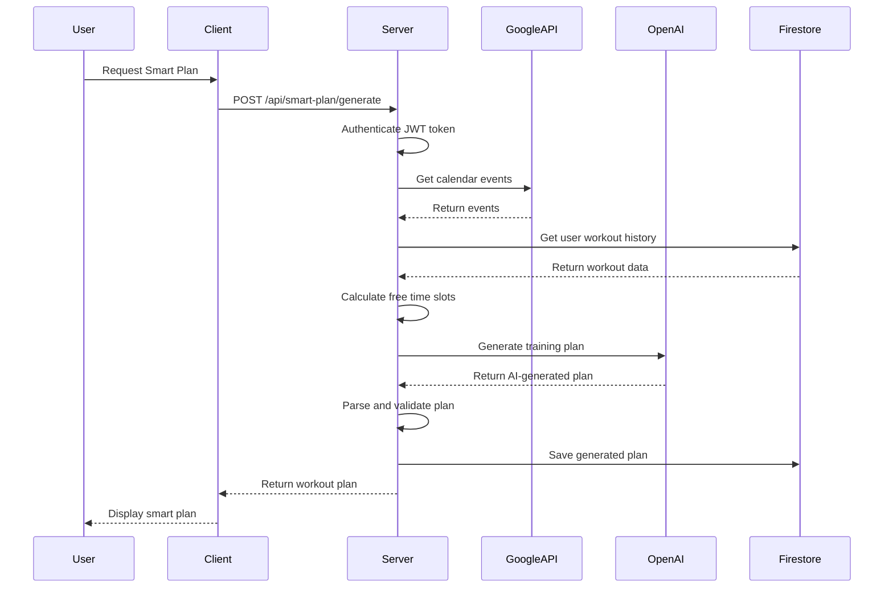
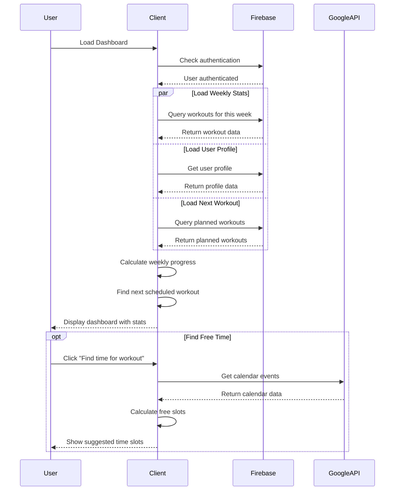
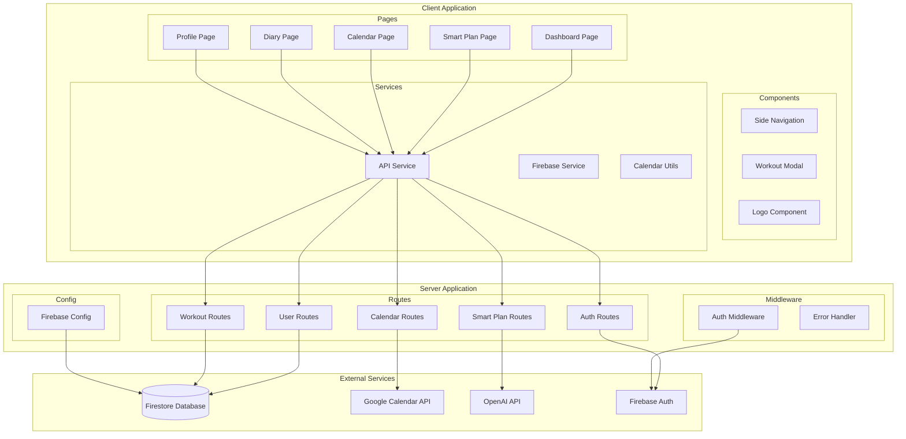
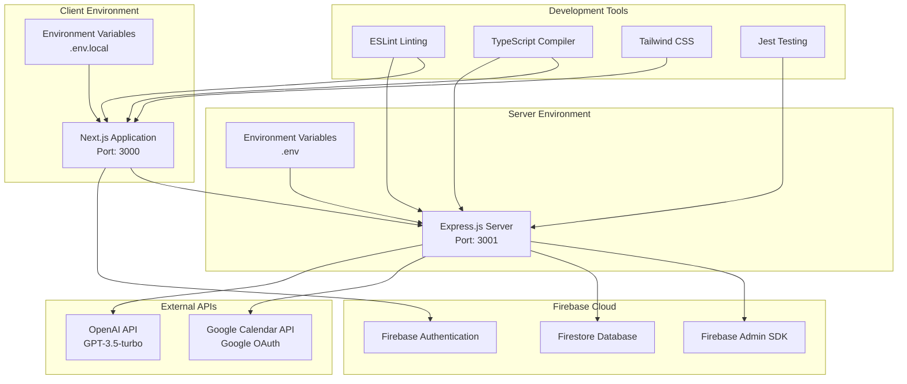

# MyFit Time - UML Diagrams

## Use Case Diagram



## Class Diagram

```mermaid
classDiagram
    class User {
        +String uid
        +String email
        +String displayName
        +String photoURL
        +Date createdAt
        +WeeklyGoal weeklyGoal
        +String preferredTime
        +Boolean reminderEnabled
        +login()
        +logout()
        +updateProfile()
    }

    class WeeklyGoal {
        +String type
        +Number value
        +calculateProgress()
    }

    class Workout {
        +String id
        +String userId
        +Date date
        +String time
        +String type
        +Number distance
        +String duration
        +String pace
        +Number calories
        +String status
        +save()
        +update()
        +delete()
    }

    class SmartPlan {
        +String userId
        +String trainingGoal
        +Date targetDate
        +Number weeklyGoal
        +Workout[] workouts
        +generate()
        +save()
    }

    class CalendarEvent {
        +String id
        +Date start
        +Date end
        +String summary
        +String description
    }

    class TimeSlot {
        +Date start
        +Date end
        +String preference
        +Boolean available
    }

    class AuthService {
        +verifyToken(token)
        +createUser(userData)
        +getCurrentUser()
    }

    class WorkoutService {
        +getWorkouts(userId)
        +createWorkout(workoutData)
        +updateWorkout(id, updates)
        +deleteWorkout(id)
    }

    class CalendarService {
        +getEvents(token)
        +findFreeSlots(events, preferences)
        +scheduleWorkout(workout)
    }

    class SmartPlanService {
        +generatePlan(goals, history, slots)
        +optimizePlan(plan)
        +savePlan(plan)
    }

    User ||--o{ Workout : creates
    User ||--|| WeeklyGoal : has
    User ||--o{ SmartPlan : generates
    SmartPlan ||--o{ Workout : contains
    CalendarService ..> CalendarEvent : uses
    CalendarService ..> TimeSlot : generates
    SmartPlanService ..> SmartPlan : creates
    WorkoutService ..> Workout : manages
    AuthService ..> User : manages
```

## Activity Diagram - Smart Plan Generation



## Activity Diagram - User Authentication Flow



## Activity Diagram - Workout Logging



## Sequence Diagram - Smart Plan Generation



## Sequence Diagram - Dashboard Data Loading



## Component Diagram



## Deployment Diagram

